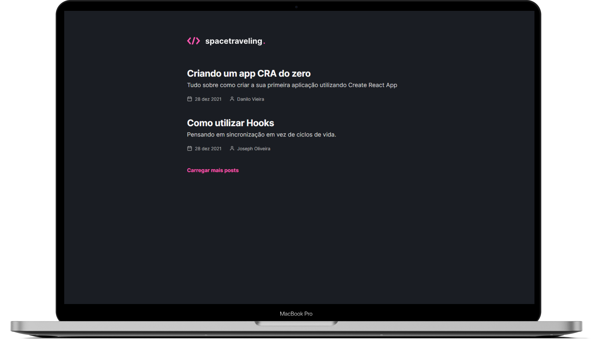
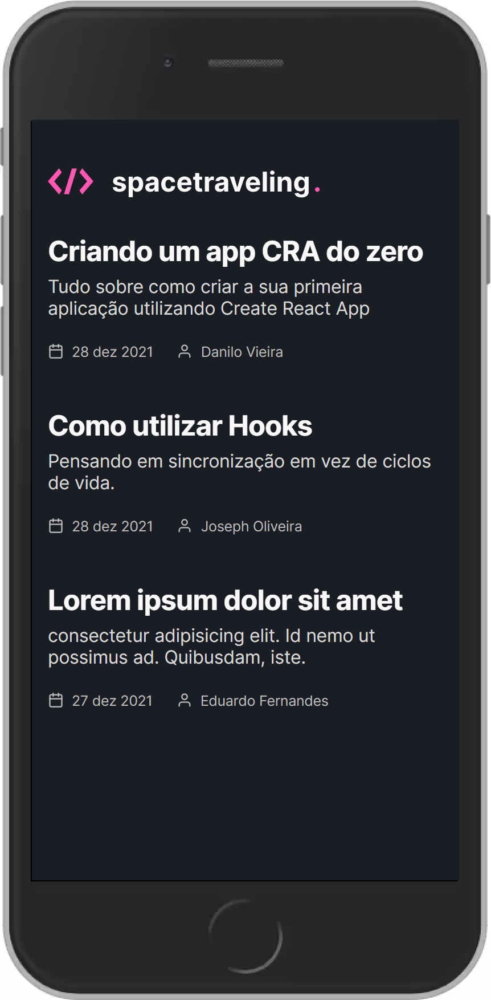
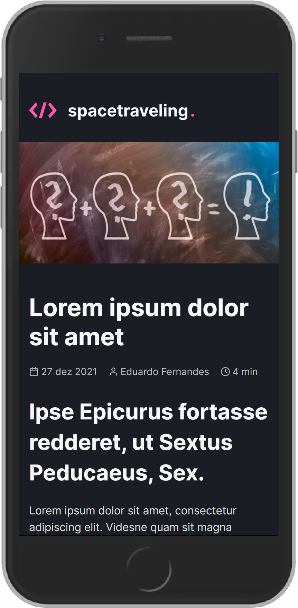

<h1 align="center">
  </img>
</h1>

<p align="center">
  <a href="#ℹ-descrição">Descrição</a> •
  <a href="#-tecnologias">Tecnologias</a> •
  <a href="#-pré-requisitos">Pré-requisitos</a> •
  <a href="#-como-usar">Como usar</a> •
  <a href="#-espiadinha">Espiadinha</a>
</p>

<p align="center">
  </img>
</p>

## ℹ Descrição

Projeto desenvolvido como desafio principal do capítulo 3 do Ignite. 👨‍🚀🚀

O desafio consistia em construir uma aplicação do zero, um blog sobre programação. É recebida uma aplicação praticamente em branco que deve consumir os dados do _Prismic_ e ter a interface implementada conforme o layout do _Figma_. Ademais, foi necessário implantar:

- Estilizações global, comum e individuais;
- Importação de fontes Google;
- Paginação de posts;
- Cálculo de tempo estimado de leitura do post;
- Geração de páginas estáticas com os métodos _getStaticProps_ e _getStaticPaths_;
- Formatação de datas com date-fns;
- Uso de ícones com react-icons;
- Requisições HTTP com fetch;
- Entre outros.

## ⚒ Tecnologias

- [**React**](https://pt-br.reactjs.org)
- [**Typescript**](https://www.typescriptlang.org)
- [**Next.js**](https://nextjs.org)
- [**styled-components**](https://styled-components.com)
- [**Prismic CMS**](https://prismic.io)
- [**datefns**](https://date-fns.org)
- [**react-icons**](https://react-icons.github.io/react-icons)

## ⚙ Pré-requisitos

- [Git](https://git-scm.com)
- [Yarn](https://yarnpkg.com)
- Editor de código.

## 🖥 Como usar

**Clone o projeto e acesse a pasta**

```bash
$ git clone https://github.com/EduardoReisUX/desafio04-trilha-reactjs.git && cd desafio04-trilha-reactjs
```

**Siga os passos seguintes**

```bash
# Instale as dependências
$ yarn

# Verifique os testes unitários
$ yarn test

# Rode a aplicação
$ yarn dev
```

## 👀 Espiadinha

<p align="center">
</img>
</img>
</p>

---

<p align="center">Feito com 💜 por <a href="https://github.com/EduardoReisUX">Eduardo dos Reis</a></p>
